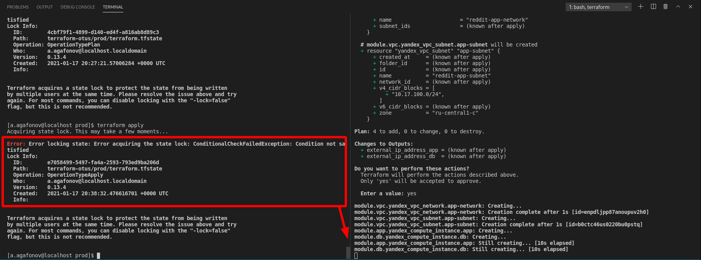
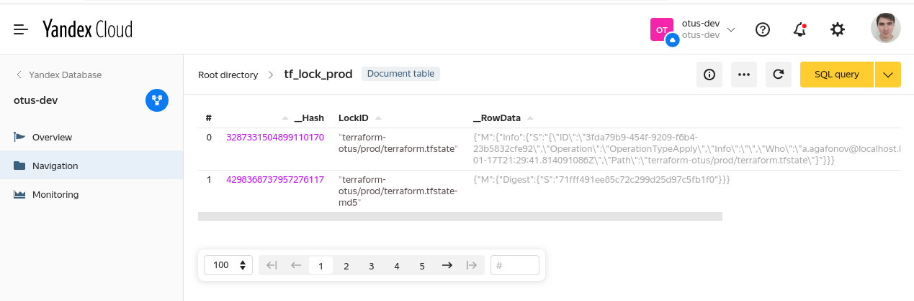

# Выполнено ДЗ terraform-2 № 9

1. Удалите из папки terraform файлы main.tf, outputs.tf, terraform.tfvars, variables.tf, так как они теперь перенесены в stage и prod

2. Параметризируйте конфигурацию модулей насколько считаете нужным

3. Отформатируйте конфигурационные файлы, используя команду terraform fmt

   Задания со *:

4. Настройте хранение стейт файла в удаленном бекенде (remote backends) для окружений stage и prod, используя Yandex Object Storage в качестве бекенда. Описание бекенда нужно вынести в отдельный файл backend.tf

5.  Перенесите конфигурационные файлы Terraform в другую директорию (вне репозитория). Проверьте, что state-файл (terraform.tfstate) отсутствует. Запустите Terraform в обеих директориях и проконтролируйте, что он "видит" текущее состояние независимо от директории, в которой запускается

6. Попробуйте запустить применение конфигурации одновременно, чтобы проверить работу блокировок

7. Добавьте необходимые provisioner в модули для деплоя и работы приложения. Файлы, используемые в provisioner, должны находится в директории модуля.

8.  Опционально можете реализовать отключение provisioner в зависимости от значения переменной

9. Добавьте описание в README.md

## В процессе сделано:
 - Описана инфраструктура при помощи terraform и провайдера yandex
 - выполнены все дополнительные доп. задания с *.
    - Файл состояния перенесен в тарраформ backend.
    - Сделанs lock при помощи yandex Database. (см. ниже снимки)

 -

    - Добавлены необходыми провижены - которые добавляют IP БД в глобальную переменную, так же добавленые необходимые зависимости.

    - app  и mongodv запускаются из заранее подгоовленных образов - и дополнительных манипуляций не требуют

    - Создание unit для старта приложения - происводится при помоши провижена в терраформ.

## Как запустить проект:

 - Определить\создать путь и сам файл ключа для сервисного акк, при помощи которого возможно развернуть инфраструктуру.
 - Перейти в папку с  необходимым окружением .
 - для проверки выполняем `terraform plan`
 - Если все ок - то применяем `terraform apply`

## Как проверить работоспособность:
 -

## PR checklist
 - [*] Выставил label с номером домашнего задания
 - [*] Выставил label с темой домашнего задания
