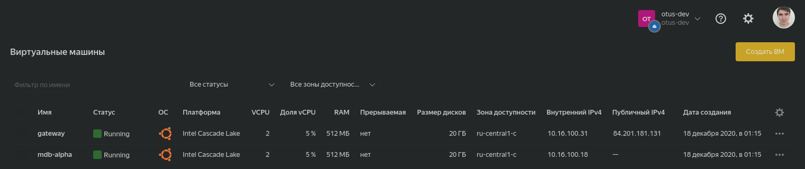
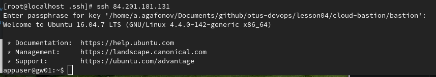
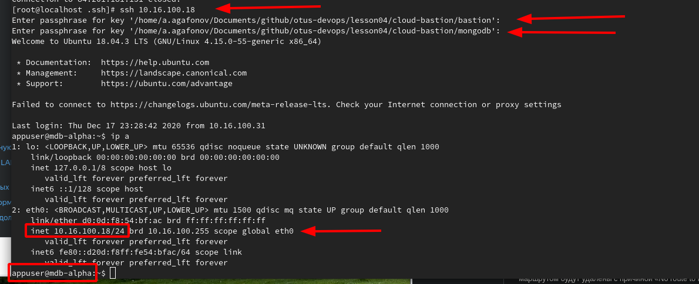
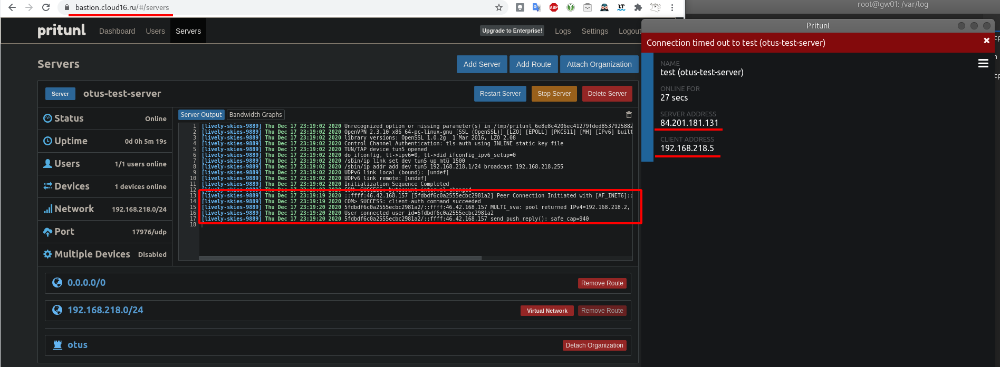
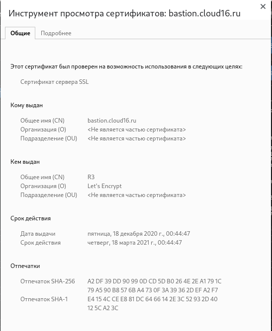
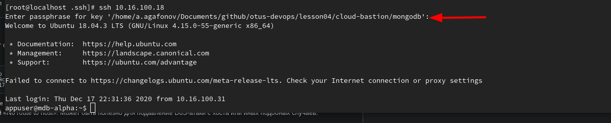

# Знакомство с облачной инфраструктурой и облачными сервисами (HW_5)


## Полное задание:

1. Выполните задание про подключение через бастион хост.

2. Добавьте в ваш репозиторий Infra (ветка cloud-bastion):

   1. файл setupvpn.sh
   2. конфигурационный файл для подключения к VPN (переименуйте *.ovpn в cloud-bastion.ovpn)

3. Опишите в README.md и получившуюся конфигурацию и данные для подключения в следующем формате (формат важен для проверки!).

4. Добавьте "Labels" cloud-bastion к вашему Pull Request

   #### Задания со звездочкой:

   1. Предложить вариант решения для подключения из консоли при помощи команды вида ssh someinternalhost из локальной консоли рабочего устройства, чтобы подключение выполнялось по алиасу someinternalhost и внести его в README.md в вашем репозитории
   2. С помощью сервисов https://xip.io//https://letsencrypt.org/ и реализуйте использование валидного сертификата для панели управления VPN-сервера

   ## Решение:

### Инфраструктура:

Для выполнения домашнего задания в Ya Cloud созданы 2 вирутальные машины



Приватная сеть 10.16.100.0/24


  Outputs:
bastion_IP = 84.201.181.131
someinternalhost_IP = 10.16.100.18


Созданы пользователи 'appuser' на каждой машине и добавлены ssh ключи(приложены к репе).

### Организация подключения к машинам:

Сразу опиши способ подключения одной строкой(задание со звездочкой). Для этого можно использовать proxyJump. Подготовим нашу хостовую машину и изменим конфигурационный  файл ~/.ssh/config:

```bash
Host 84.201.181.131
    User appuser
    IdentityFile  "{path_to_ssh_bastion_key}"
    ForwardAgent yes


Host 10.16.100.18
    User appuser
    ProxyJump 84.201.181.131
    IdentityFile  "{path_to_ssh_mongo_key}"
```

И этого достаточно для подключения в нашим машинкам.

1. подключаемся к bastion

   

2. Подключаемся к машинке внутри сети используя бастион хост:

   Обращаю внимание, что т.к. есть необходимость авторизоваться на каждой из машин и учитывая что ключи там разные - требуется для каждого ключа отдельно вводить  passphase:

   

При желании использовать короткое понятно имя - в файл hosts (/etc/hosts) добавить запись вида
`10.16.100.18 somehost`, скорректировать соответствующим образом файл config и подклчюение производить уже используя имя.

---

К репозиторию приложен файл [setupvpn.sh](setupvpn.sh)

Конфигурационные файл для OPNVPN - [cloud-bastion.ovpn](cloud-bastion.ovpn)

---

## OpenVPN server

На адресе https://bastion.cloud16.ru   развернут VPN серверб так же настроен https сертификат.
Согласно заданию создан пользователь test с необходимым PIN.

На снимке видно, что настроен VPN сервер и имеется активное соединение (слева), и подключенный сам клиент(справа), а так же сертифик Let'sEncrypt(снимок ниже:






Проверяем подключение к машинке внутри локальной сети:

Команда для проверки: `ssh -i {path_to_ssh_key} appuser@10.16.100.18`


